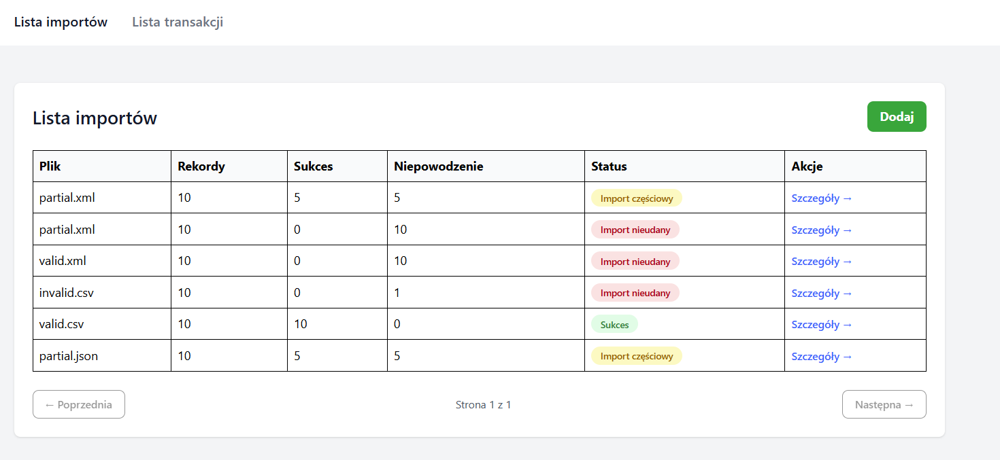
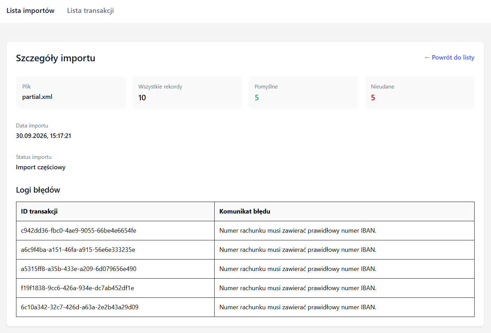
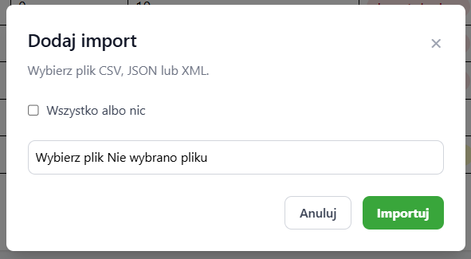
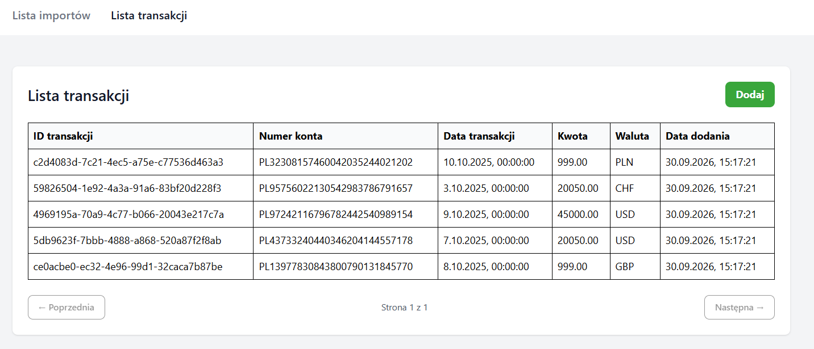

# Import transakcji bankowych

Aplikacja do importowania transakcji bankowych z plików **CSV, JSON i XML**.

Projekt został wykonany w oparciu o:

* **Laravel 12** – backend REST API
* **Vue 3** – frontend
* **Tailwind CSS** – stylowanie interfejsu
* **MySQL**– baza danych
* **Vite** – budowanie frontendu

## Funkcjonalności

Aplikacja umożliwia:

* przesłanie pliku CSV, JSON lub XML,
* walidację każdej transakcji,
* zapis poprawnych transakcji w bazie danych,
* zapis błędnych rekordów w logach importu,
* zapis informacji o każdym imporcie,
* wyświetlenie listy wykonanych importów,
* wyświetlenie szczegółów wybranego importu,
* wyświetlenie komunikatów błędów dla niepoprawnych rekordów,
* automatyczne odświeżenie listy importów po wykonaniu importu,
* wyświetlenie listy zaimportowanych transakcji.

### Przykładowe pliki

W folderze `examples/` znajdują się przykładowe pliki CSV, JSON i XML, które można wykorzystać do przetestowania importu.

## Architektura

### Backend

Backend został podzielony na kilka odpowiedzialności.

```text
app/
├── Http/
│   ├── Controllers/
│   │   ├── Controller.php
│	│	├── ImportController.php
│	│	└── TransactionController.php
│   └── Requests/
│       └── ImportRequest.php
│
├── Import/
│   ├── Contracts/
│   │   └── ImportParser.php
│   ├── Parsers/
│   │   ├── CsvParser.php
│   │   ├── JsonParser.php
│   │   └── XmlParser.php
│   ├── ImportParserFactory.php
│   └── TransactionValidator.php
│
├── Models/
│   ├── Import.php
│   ├── ImportLog.php
│   └── Transaction.php
│
├── Rules/
│   └── ValidAmount.php
│
└── Services/
    └── ImportService.php
```

### Przepływ importu

```text
POST /api/imports
        │
        ▼
ImportController
        │
        ▼
ImportService
        │
        ▼
ImportParserFactory
        │
        ├── CSV → CsvParser
        ├── JSON → JsonParser
        └── XML → XmlParser
        │
        ▼
Ujednolicone rekordy
        │
        ▼
TransactionValidator
        │
        ├── poprawny rekord
        │       ↓
        │   transactions
        │
        └── błędny rekord
                ↓
            import_logs
```

Dzięki zastosowaniu wspólnego interfejsu `ImportParser` dodanie kolejnego formatu pliku nie wymaga zmiany logiki znajdującej się w `ImportService`.

## Walidacja

Każdy rekord jest walidowany niezależnie.

Obowiązujące reguły:

| Pole               | Walidacja                           |
| ------------------ | ----------------------------------- |
| `transaction_id`   | wymagane                            |
| `account_number`   | wymagane, poprawny IBAN             |
| `transaction_date` | wymagana poprawna data              |
| `amount`           | wymagana liczba większa od 0        |
| `currency`         | wymagane dokładnie 3 wielkie litery |

Niepoprawne rekordy nie są zapisywane w tabeli `transactions`.

Zamiast tego do `import_logs` trafiają:

* identyfikator importu,
* `transaction_id`,
* komunikat błędu.

## Status importu

Import może otrzymać jeden z trzech statusów:

| Status    | Znaczenie                                                     |
| --------- | ------------------------------------------------------------- |
| `success` | wszystkie rekordy zostały poprawnie zaimportowane             |
| `partial` | część rekordów została zaimportowana, a część zawierała błędy |
| `failed`  | żaden rekord nie został poprawnie zaimportowany               |

## Struktura bazy danych

### `transactions`

Przechowuje poprawnie zaimportowane transakcje.

```text
id
transaction_id
account_number
transaction_date
amount
currency
created_at
```

### `imports`

Przechowuje informacje o wykonanych importach.

```text
id
file_name
total_records
successful_records
failed_records
status
created_at
```

### `import_logs`

Przechowuje błędy dotyczące poszczególnych rekordów.

```text
id
import_id
transaction_id
error_message
created_at
```

## API

### POST `/api/imports`

Importuje plik.

### GET `/api/imports`

Zwraca listę wykonanych importów.

### GET `/api/imports/{id}`

Zwraca szczegóły wybranego importu wraz z logami błędów.

## Frontend

Frontend został wykonany w Vue 3.

Struktura:

```text
resources/js/
├── app.js
├── App.vue
│
├── router/
│   └── index.js
│
├── views/
│   └── Imports/
│       ├── ImportsIndex.vue
│		├── TransactionsIndex.vue
│       └── ImportDetails.vue
│
└── components/
    ├── Navigation.vue
	├── ImportDetails.vue
	├── TransactionsList.vue
    ├── ImportsList.vue
    └── ImportUploadModal.vue

```

### Widok listy importów



### Szczegóły importu



### Okienko importu



### Widok listy transakcji



## Wymagania

Do uruchomienia projektu potrzebne są:

* PHP 8.2+
* Composer
* Node.js
* npm
* baza danych obsługiwana przez Laravel

## Testy

Testy można uruchomić poleceniem:

```bash
php artisan test
```

## Przykładowy plik CSV

```csv
transaction_id,account_number,transaction_date,amount,currency
TX001,PL61109010140000071219812874,2026-09-01,100.00,PLN
TX002,PL61109010140000071219812874,2026-09-02,250.50,PLN
```

Separatorem dla plików CSV jest przecinek.

### Factory

`ImportParserFactory` wybiera parser na podstawie rozszerzenia pliku.

```text
csv → CsvParser
json → JsonParser
xml → XmlParser
```

### Walidacja na dwóch poziomach

Walidacja pliku wykonywana jest na poziomie requestu, natomiast walidacja poszczególnych rekordów wykonywana jest podczas importu.

Dzięki temu pojedynczy błędny rekord nie blokuje całego importu.

### Logowanie błędów

Błędne rekordy nie są zapisywane jako transakcje. Ich błędy są zapisywane w `import_logs`, dzięki czemu użytkownik może sprawdzić, które rekordy wymagały poprawy.

